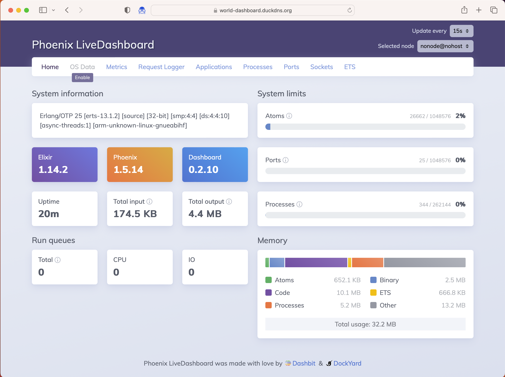

   * https://world-dashboard.duckdns.org/dashboard

# See also
   * https://github.com/rogeriomm/public-server

# Links
   * https://medium.com/swlh/use-docker-to-create-an-elixir-phoenix-development-environment-e1a81def1d2e
   * https://github.com/phoenixframework/phoenix_live_dashboard
